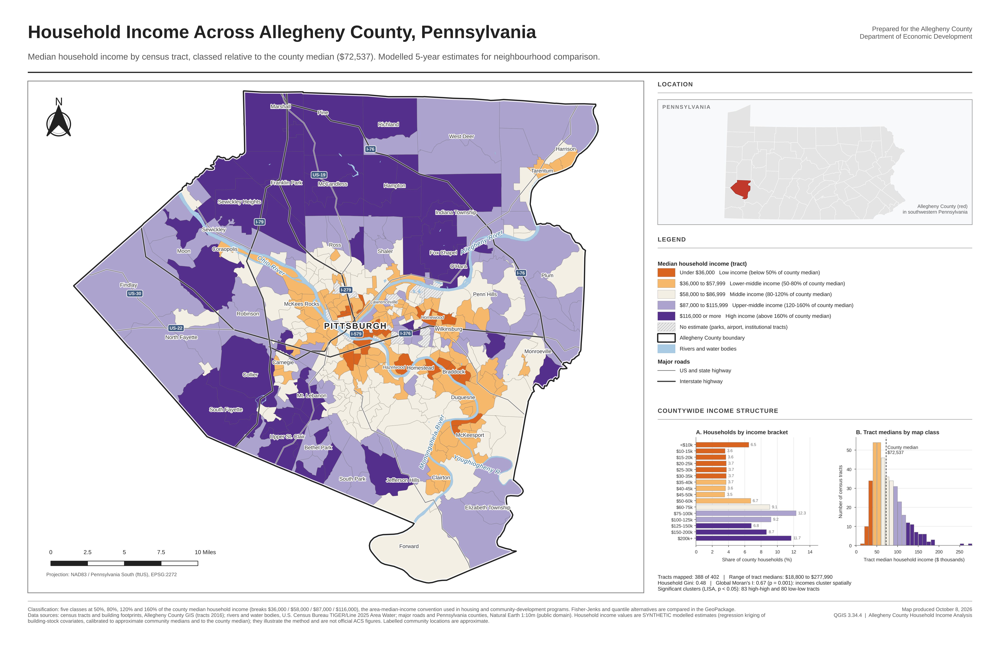

# Household Income Distribution in Allegheny County, Pennsylvania

A reproducible GIS workflow that turns census-tract, hydrography, road, county and building-footprint
data into a publication-ready household-income map for the Allegheny County Department of Economic
Development. It produces the three required deliverables:

| deliverable | file |
|---|---|
| 300 DPI PNG map (17 × 11 in, 5100 × 3300 px) | `output/allegheny_household_income_map_300dpi.png` |
| QGIS project with the print layout | `output/allegheny_household_income.qgz` |
| GeoPackage with all processed outputs | `output/allegheny_household_income.gpkg` |

A vector PDF of the same layout (`output/allegheny_household_income_map.pdf`) and the summary chart
(`output/figures/`) are produced too.



> **Data honesty.** Tract boundaries, water, roads, counties and building footprints are real. The
> **household-income values are synthetic**: the package had no income attributes and the Census API
> was unreachable, so a calibrated statistical model generates them (see
> [docs/METHODOLOGY.md](docs/METHODOLOGY.md)). The map, GeoPackage (`is_synthetic_income`,
> `data_sources`) and attribution all say so.

---

## Step by step: what was done and why

1. **Read the brief and inventoried the inputs.** The brief expects a GeoPackage with
   `allegheny_boundary`, `income_tracts`, `municipalities`, `roads`, `waterways` and
   `pennsylvania_counties`. What actually arrived: 2016 census tracts (402 polygons, no income),
   TIGER/Line 2025 area water (41 polygons) and 573,908 building footprints with assessment class and
   land-use codes.
2. **Filled the gaps, preferring real public data.** The network allowed Natural Earth, so the
   Pennsylvania counties (67) and major highways (I-76, I-79, I-279, I-376, I-579, US-19/22/30,
   PA-28/51/65) are real 1:10m data. The county boundary is dissolved from the tracts. Census
   servers were blocked, so income had to be generated, and municipal boundaries are approximated
   by grouping tracts around 157 named community reference points (layer `municipalities`, marked
   synthetic and used only for labels).
3. **Derived real built-environment covariates per tract** from the footprints: building
   density, single-family share, median house footprint, industrial and commercial floor-area
   share, distance to the rivers and to downtown, and estimated dwelling units. Households were
   allocated from dwelling units.
4. **Generated tract income with regression kriging**: a ridge-regression trend on those
   covariates, kriged residuals that honour approximate community medians, and spatially
   autocorrelated SAR noise. Then calibrated the level to the county median of $72,537 and fitted
   Dagum within-tract distributions so the county's household bracket shares match an ACS-style
   profile. Validation: leave-one-out error ≈ 25 %, Gini 0.48, realistic urban/suburban/Mon Valley
   geography.
5. **Classified incomes relative to the county median** (50/80/120/160 %, HUD AMI convention:
   $36k / $58k / $87k / $116k) and compared against an exact Fisher–Jenks optimiser and quintiles
   (GVF and TAI in `classification_comparison`).
6. **Measured spatial structure and inequality**: global Moran's I = 0.67 (p = 0.001), LISA
   clusters per tract, household Gini, bracket distribution.
7. **Wrote everything to one GeoPackage** (16 layers/tables, listed below).
8. **Built the QGIS project and layout headlessly with PyQGIS 3.34**: diverging colour-blind-safe
   palette centred on the county median, thin tract outlines, muted roads and water, label
   hierarchy, locator inset, legend, north arrow, scale bar in miles, integrated chart, key
   statistics, classification note and source attribution. Exported PNG at 300 DPI plus PDF.
9. **Tested**: 19 pytest tests cover the mathematics (Jenks against brute force, Moran's I on known
   patterns, Dagum mean against numerical integration, kriging exactness) and the deliverables (layers
   present, PNG is 300 DPI, .qgz reopens with valid layers and both map frames).

## How the map meets each rubric item

| # | requirement | how it is met |
|---|---|---|
| 1 | Income analysis focused on Allegheny County | Title, subtitle, county-only extent, county outline |
| 2 | Lower vs higher income clearly distinguished | 5 diverging classes, orange = below median, purple = above, neutral at the median |
| 3 | Realistic urban/suburban/rural patterns | Low: Hill District, Homewood, Braddock, McKeesport, Clairton, river corridors. High: Fox Chapel, Sewickley Heights, Upper St. Clair, Pine, Marshall, Mt. Lebanon. Middle: rural Findlay, Forward, Elizabeth Twp |
| 4 | Tract boundaries visible | 0.09 mm grey tract outlines over every fill, county outline with white halo |
| 5 | Integrated summary visualisation | Two-panel chart (households by bracket; histogram of tract medians in map colours) + key statistics |
| 6 | Balanced hierarchy | Thematic fill dominates; roads thin grey; water pale blue; labels buffered and size-graded |
| 7 | Locator inset | Pennsylvania counties, Allegheny in red, equal-area projection |
| 8 | Title, legend, north arrow, scale bar with units, attribution | All present; scale bar labelled "Miles"; sources and synthetic-data note in footer |
| 9 | Readable, organised layout | Fixed grid: map left, inset/legend/chart right, footer notes |
| 10 | Roads and water give context without overpowering | Water #a9cbe3, roads 0.28–0.5 mm grey with white casing, only interstate/US shields |
| 11 | 300 DPI PNG | 5100 × 3300 px with 300 DPI metadata (tested) |
| 12 | .qgz + GeoPackage | Both in `output/`; the project uses relative paths so the folder can be moved |

## GeoPackage contents

| layer | type | description |
|---|---|---|
| `allegheny_boundary` | polygon | county outline (from tracts) |
| `income_tracts` | polygon | 402 tracts: households, median/mean income, MOE, class, LISA, covariates |
| `municipalities` | polygon | approximate community areas (synthetic, for labels/summaries) |
| `roads` | line | Natural Earth major highways, with route and class |
| `waterways` | polygon | TIGER/Line 2025 rivers, lakes, reservoirs |
| `pennsylvania_counties` | polygon | 67 counties for the inset, `is_study_area` flag |
| `map_labels` | point | river, city, community and neighbourhood labels with rotation |
| `calibration_anchors` | point | community reference medians used by the model |
| `household_income_brackets` | table | households per tract per ACS B19001 bracket |
| `county_income_distribution` | table | countywide bracket shares (drives chart panel A) |
| `income_class_summary` | table | tracts, households, land area per class |
| `classification_comparison` | table | median-relative vs Jenks vs quantile, GVF/TAI |
| `model_coefficients` | table | ridge trend coefficients |
| `residual_semivariogram` | table | empirical semivariogram of trend residuals |
| `summary_statistics` | table | county median, Gini, Moran's I, LISA counts, model diagnostics |
| `data_sources` | table | provenance and synthetic flag for every layer |

## Setup and run

Requirements: QGIS ≥ 3.30 with Python bindings, plus `requirements.txt`.

```bash
# Ubuntu 24.04 example
sudo apt-get install python3-qgis qgis-providers
python3 -m venv --system-site-packages .venv && . .venv/bin/activate
pip install -r requirements.txt

# building footprints (~90 MB) are not committed; point to your copy
export ACI_FOOTPRINTS_ZIP=/path/to/alcogisallegheny-county-building-footprint-locations.zip

make all PY=.venv/bin/python     # GeoPackage, chart, .qgz, PNG, PDF
make test PY=.venv/bin/python
```

On Windows or macOS run the two scripts from the QGIS Python console or the OSGeo4W shell
(`python scripts/01_build_geopackage.py`, then `python scripts/02_build_qgis_project.py`). Natural
Earth archives download on first run into `data/cache/`.

## Repository layout

```
config/    calibration anchors and reference county bracket profile (inputs to the model)
data/raw/  supplied tract and water archives
docs/      METHODOLOGY.md: every equation and parameter
scripts/   01_build_geopackage.py (stage 1), 02_build_qgis_project.py (stage 2)
src/aci/   sources, features, model, classify, spatial_stats, reference, chart, settings
tests/     unit tests for the mathematics and checks on the outputs
output/    deliverables
```
